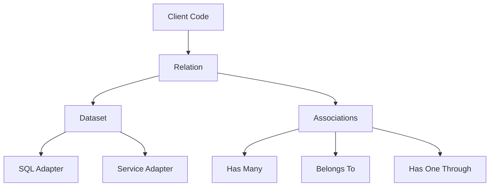

# Resources Library Documentation

## Overview

The Resources library is a powerful and flexible data handling solution designed to simplify complex data operations across various data sources. It provides a unified interface for working with both SQL and service-based data, allowing developers to build sophisticated queries and relationships with ease.

### Key Features

1. **Unified Data Interface**: Seamlessly work with SQL databases and external services using a consistent API.

2. **Advanced Association Handling**: Define and navigate complex relationships between different data entities.

3. **Flexible Query Building**: Construct complex queries with support for joins, filtering, sorting, and aggregations.

4. **Cross-Adapter Operations**: Perform joins and other operations across different data sources (e.g., SQL and service-based).

5. **Performance Optimized**: Designed for efficient handling of large datasets and complex queries.

6. **Extensible Architecture**: Easily extend the library with new adapters or functionalities.

7. **Type-Safe Operations**: Leverage Ruby's type system for safer data handling.

### Unique Perspective

Unlike traditional ORMs or data mappers, the Resources library takes a more holistic approach to data handling:

- It doesn't just map objects to database tables but provides a flexible way to define and work with data from any source.
- The library allows for complex operations across different data adapters, enabling powerful data aggregation and analysis capabilities.
- It emphasizes a declarative style of defining relationships and queries, promoting cleaner and more maintainable code.

## Main Interface and Architecture Design

The Resources library is built on a modular architecture that promotes flexibility and extensibility. Here's an overview of the main components and their interactions:

### Core Components

1. **Relation**: The central concept, representing a queryable set of data.
   ```ruby
   class User < Resources::Relation
     # ...
   end
   ```

2. **Dataset**: Represents the actual data source (e.g., SQL table, external service).
   ```ruby
   class SqlDataset < Resources::Dataset
     # ...
   end
   ```

3. **Associations**: Define relationships between different relations.
   ```ruby
   class User < Resources::Relation
     associate do
       has_many :posts
       belongs_to :company
     end
   end
   ```

4. **Query Methods**: Methods for building and executing queries.
   ```ruby
   User.new(context: context)
       .where(name: /John/)
       .join(relation: Post, join_keys: { id: :user_id })
       .order(name: :asc)
       .limit(10)
       .to_a
   ```

### Architecture Diagram



### Key Design Decisions

1. **Separation of Concerns**: Clear separation between relation definitions, query building, and data retrieval.

2. **Adapter Pattern**: Use of adapters for different data sources, allowing easy extension to new types of data stores.

3. **Composable Queries**: Query methods that return new relation instances, enabling method chaining and composition.

4. **Lazy Evaluation**: Queries are built up and only executed when data is actually needed.

5. **Flexible Association Definitions**: Associations can be defined declaratively and work across different adapters.

### Module Interactions

- **Relation** interacts with **Dataset** to execute queries.
- **Associations** enhance **Relation** with relationship navigation capabilities.
- **Query Methods** in **Relation** build up a query that is eventually executed by the **Dataset**.
- **Adapters** (SQL, Service) provide the actual implementation for data retrieval and manipulation.

This architecture allows for a high degree of flexibility and extensibility, enabling the library to handle a wide range of data handling scenarios while maintaining a consistent and intuitive interface for developers.

Certainly! I'll add more examples of usage and include a note about the next steps for mapping and composing items with schemas. Here's the additional content:

## Usage Examples

Let's explore some more detailed examples of how to use the Resources library in various scenarios:

### 1. Complex Querying Across Multiple Relations

```ruby
class Order < Resources::Relation[:sql]
  associate do
    belongs_to :customer
    has_many :line_items
    has_one :invoice
  end
end

class Customer < Resources::Relation[:sql]
  associate do
    has_many :orders
  end
end

class LineItem < Resources::Relation[:sql]
  associate do
    belongs_to :order
    belongs_to :product
  end
end

class Product < Resources::Relation[:service]
  associate do
    has_many :line_items
  end
end

# Query for high-value orders with specific product categories
result = Order.new(context: context)
  .join(relation: :customer)
  .join(relation: :line_items)
  .join(relation: { line_items: :product })
  .where(total_amount: { gt: 1000 })
  .where(customer: { loyalty_tier: 'gold' })
  .where(line_items: { product: { category: ['electronics', 'appliances'] } })
  .order(created_at: :desc)
  .limit(20)
  .to_a
```
### 2. Cross-Adapter Operations

```ruby
class User < Resources::Relation[:sql]
  associate do
    has_many :orders
  end
end

class Order < Resources::Relation[:sql]
  associate do
    belongs_to :user
    has_many :line_items
  end
end

class Product < Resources::Relation[:service]
  associate do
    has_many :line_items
  end
end

# Fetch users with their orders and associated product details
result = User.new(context: context)
  .join(relation: :orders)
  .join(relation: { orders: :line_items })
  .join(relation: { orders: { line_items: :product } })
  .where(orders: { status: 'completed' })
  .where(orders: { line_items: { product: { in_stock: true } } })
  .select(
    :id,
    :name,
    orders: [:id, :total_amount],
    products: [:id, :name, :price]
  )
  .to_a
```

## Next Steps: Mapping and Composing with Schemas

To further enhance the efficiency and type safety of our library, the next major development step is to implement mapping and composition of items using schemas. This addition will bring several benefits:

1. **Reduced Iterations**: By defining schemas for our data structures, we can avoid unnecessary array iterations when processing query results. This will lead to improved performance, especially for large datasets.

2. **Type Safety**: Schemas will provide a way to ensure that the data conforms to expected types and structures, catching potential issues early in the development process.

3. **Automatic Transformations**: With schemas in place, we can automatically transform data between different representations (e.g., database records to domain objects) without manual mapping.

4. **Composition**: Schemas will allow for easy composition of complex data structures from simpler components, facilitating the creation of rich, nested data models.

Here's a conceptual example of how this might look:

```ruby
class UserSchema < Resources::Schema
  attribute :id, Types::Integer
  attribute :name, Types::String
  attribute :email, Types::String.constrained(format: /\A[\w+\-.]+@[a-z\d\-]+(\.[a-z\d\-]+)*\.[a-z]+\z/i)
  attribute :orders, Types::Array.of(OrderSchema)
end

class OrderSchema < Resources::Schema
  attribute :id, Types::Integer
  attribute :total_amount, Types::Decimal
  attribute :line_items, Types::Array.of(LineItemSchema)
end

class LineItemSchema < Resources::Schema
  attribute :id, Types::Integer
  attribute :product_id, Types::Integer
  attribute :quantity, Types::Integer
  attribute :price, Types::Decimal
end

# Usage with automatic mapping
users_with_orders = User.new(context: context)
  .join(relation: { orders: :line_items })
  .map_to(UserSchema)
  .to_a

# The result would be an array of UserSchema objects with nested OrderSchema and LineItemSchema objects
```

By implementing this schema-based approach, we can significantly reduce the amount of manual data transformation code, improve performance, and enhance the overall robustness of applications built with the Resources library.
